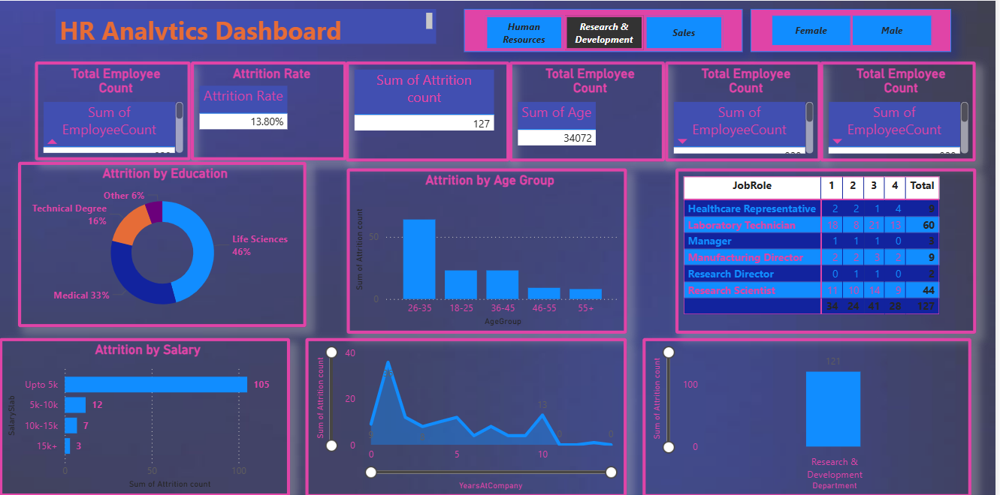
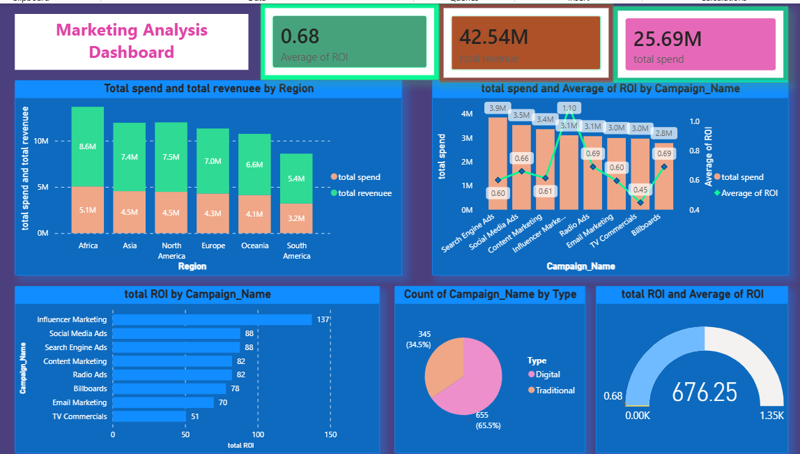

# 📊 Power BI Analytics Dashboards

Welcome to the Power BI Analytics repository. This project showcases two comprehensive interactive dashboards designed to provide data-driven insights for HR management and Marketing campaign performance.

---

## 🚀 Dashboards Overview

### 1. HR Analytics Dashboard 👥
An end-to-end dashboard designed to analyze employee data, identify attrition trends, and optimize workforce management.

- **Key Metrics:** Attrition Rate, Employee Count, Satisfaction Levels, Salary Analysis.
- **Insights:** Workforce demographics, department-wise attrition, and the impact of performance ratings on retention.
- **Visuals:** [View Dashboard Image](project_images/hr_analytics_dashboard_visualize.png)
- **Power BI File:** [hr_analytics_dashboard.pbix](hr_analytics_dashboard/hr_analytics_dashboard.pbix)
- **Dataset:** [HR_Analytics.csv](hr_analytics_dashboard/dataset/HR_Analytics.csv)

### 2. Marketing Campaign Dashboard 📈
A strategic dashboard for tracking campaign ROI, regional performance, and conversion metrics across various industries.

- **Key Metrics:** Total Spend, Impressions, Click-Through Rate (CTR), ROI, Conversions, and Revenue.
- **Insights:** Identifying high-performing regions and industries to optimize marketing budget allocation.
- **Visuals:** [View Dashboard Image](project_images/marketing_dashboard_visualize.png)
- **Power BI File:** [marketing_dashbaord.pbix](marketing_campaign_dashboard/marketing_dashbaord.pbix)
- **Datasets:** [Marketing Campaign Data](marketing_campaign_dashboard/dataset/)

---

## 🖼️ Visualizations

### HR Analytics Preview


### Marketing Dashboard Preview


---

## 💡 DAX Queries

The project utilizes several custom DAX measures for advanced calculations. Below are some examples from the HR Analytics dashboard:

- **Attrition Count:**
  ```dax
  Attrition count = if(HR_Analytics[Attrition]=="Yes", 1, 0)
  ```
- **Attrition Rate:**
  ```dax
  Attrition Rate = SUM(HR_Analytics[Attrition count]) / SUM(HR_Analytics[EmployeeCount])
  ```

*For more details, see [dax_queries/hr_analytics_dashboard.txt](dax_queries/hr_analytics_dashboard.txt).*

---

## 📁 Repository Structure

```text
├── dax_queries/              # DAX Measures and Calculations
├── hr_analytics_dashboard/   # HR Project Files & Datasets
├── marketing_dashboard/      # Marketing Project Files & Datasets
├── project_images/           # Visual screenshots of Dashboards
└── README.md                 # Project Documentation
```

---

## 🛠️ How to Use

1. **Prerequisites:** Ensure you have [Power BI Desktop](https://powerbi.microsoft.com/desktop/) installed.
2. **Open Dashboard:** Navigate to the respective dashboard folder and open the `.pbix` file.
3. **Connect Data:** If prompted, re-map the data source to the `.csv` files located in the `dataset` sub-folders.
4. **Explore:** Use the interactive slicers and filters to drill down into the data.

---

*Developed with ❤️ using Power BI and DAX.*
